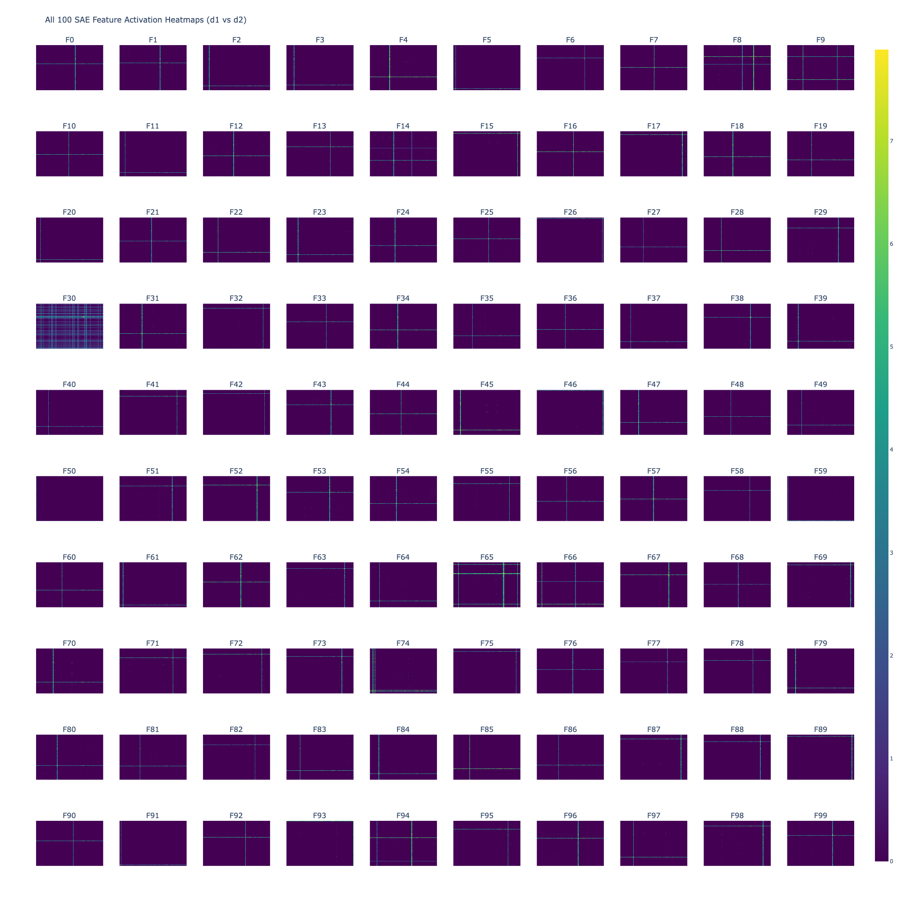
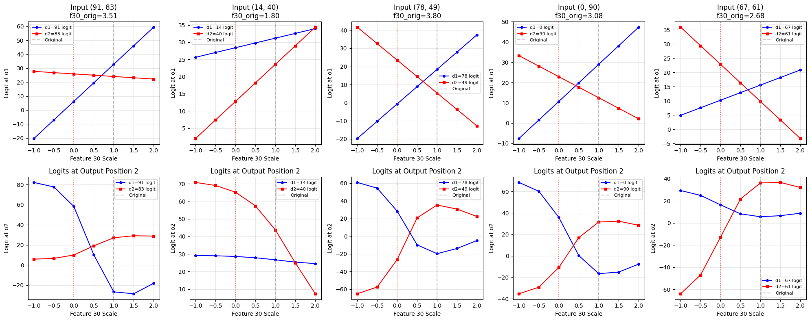

# Final Dissertation Report Notes
Notes on different parts of the report

## Related work

- mechinterp
- SAES
  - btk saes

## order by scale

use paper.

key points:
- toy model
- sep token
- graded sae latent activations

## SAE stuff

- Trained lots of btk SAEs to confirm graded latent behaviour
  - CONTEXT - `report/sae_comparison.md` is a report generated by `scripts/compare_sae.py`, but `report/saes_report_5feb.md` is a distilled version of this (==> dont overwrite!).
  - NBS - see `notebooks/nb_2026_01_20.ipynb` (old) and `notebooks/nb_2026_02_04.ipynb` (new).
  - k = {1,2,3,4}, d_sae = {50,100}, lr = {1e-4, 3e-4, 4e-4, 1e-3}, each combo repeated over 3 seeds. See bottom `report/saes_report_5feb.md` for custom report & more details.
  - k and d_sae are most important - lr and seed pretty stable (though havent tried enough to be statistically significant)
  - calculate 'reconstructed accuracy' (recon acc in table) as the model accuracy when the SEP token activation is replaced by the sae's reconstructed activation:
    - that is, we put the SAE output (SEP --> sparse dict --> SEP_recon) in place of the models actual sep activation vector
    - **baseline accuracy - 91.45%**
  - top3 and top4 with d=100 get 86.55 - 88.55% recon accuracy (~3-5% drop)
  - top1 doesnt go beyond 35%, and top2 doesnt go beyond 64%. Dim 50 is always worse for every k (also since d_model = 64, d_sae=50 actually has a smaller latent representation than the actual model, which beats the point of an SAE - so it should be worse: that's good sanity check)
  - ==> lets focus on top3 and 4 (d=100) for analysis, as they seem to accurately reconstruct the model
  - focusing on these, we create a heatmap for each feature:
     - the heatmap is a 100x100 grid - with d_1 input on the x-axis, d_2 on the y-axis
     - ==> there are 100^2 grid cells for the 100^2 possible (d_1,d_2) inputs
     - each cell ij contains the activation magnitude of that feature on that (d_i, d_j) input
     - ==> turn this into a heatmap to see which inputs they activate for

  - ^ for sae_d100_k3
  - all but feature 30 have these cross patterns. Each cross seems to represent a 'digit' detector:
    - for a given digit a, we have the lines y=a and x=a, which intersect at (d_1=a,d_2=a).
      - ==> seems that feature activates if digit a is present in either input position
    - all crosses intersect along d_1=d_2 line, and activation is strongest at these intersects
    - some features (eg. F8) have multiple! suggests that it's polysemantic - detects 2 digits
- but what about feature 30? these i call 'special features' because they activate on most inputs, and the heatmap doesn't seem particularly informative.

- **special features!**
  - in these top3 and top4 d=100 saes, every single one has either 1 or 2 'special features'
  - it's possible to identify these from the heatmap (i.e. they're the features which activate the most often) BUT they can also be identified by their correlation with alpha_diff = alpha_d1 - alpha_d2, where alpha_di is the attention from sep to d_i in 1st layer.
  - specifically - these features are the ONLY ones to strongly correlate (>0.5 or <-0.5) with alpha_diff. `identify_special_features` fn in `src/sae/sae_analysis.py` uses this fact to identify these special features automatically
    - TODO - need to confirm this correctly identifies them - sometimes it gets false positive no? eg. top1 50d
  - inspecting further, these give some lovely graphs:
  
    - this is for 5 randomly chosen datapoints from the entire train+test dataset
    - top row = logit at o_1, bottom row = logit at o_2. red line = 'predict d_2' logit (dependent on what d_2 is), blue line = 'predict d_1' logit
    - suggests that you can scale the feature to swap the outputs BUT:
    - TODO
      - need to check all other logits - it may look good here but maybe another logit overtakes
      - try 'non-special' features - does the same pattern appear (yes) ==> why is special one 'special'? have i just found a vis to fit my hopes?
      - try actually steering with it --> should be able to predict that we can boost/damp f30 by x% and swap the ouputs logits ==> (maybe) we've got a feature that controls output order

## Swapping features / crossover stuff

- Studying `sae_d100_k3_lr0.0003_seed44_2layer_100dig_64d.pt` as before
- Want to sysematically swap outputs by scaling special F30
- Current way of doing this isnt super efficient - there are defo cleverer ways to do it. 
  - key idea - all logit lines in o1 position are straight lines (should check this for each)
  - Eg. fit a line to o1 logits and estimate intercept (o1_xover) & line gradient that way. then if grad_d2 > grad_d1 at o1_xover then o1_xover is lower bound on swap region. If grad_d2 < grad_d1 then its an upper bound. If theyre equal then theres either no intersect or d1=d2 - either way, no swap region.
  - With o1_xover sorted, we look at o2 xovers. If any of them are out of the bound from o1_xover then we can skip it (E.g. o1_xover is lower bound and greater than some o2_xover --> then we can safely label that o2_xover as lower bound too but skip it because it's out of the region)
  - then move in steps of size eg. 0.05 from o1_xover and check if outputs swap. We terminate if they swap, OR 1) we reach a point where d1,d2 aren't dominant anymore or 2) we reach the next o2_xover (if applicable) - these 1) and 2) are our opposite bound to o1_xover