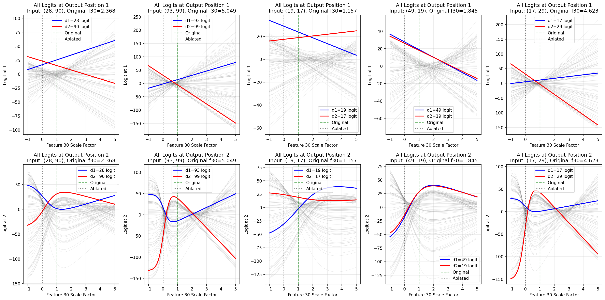
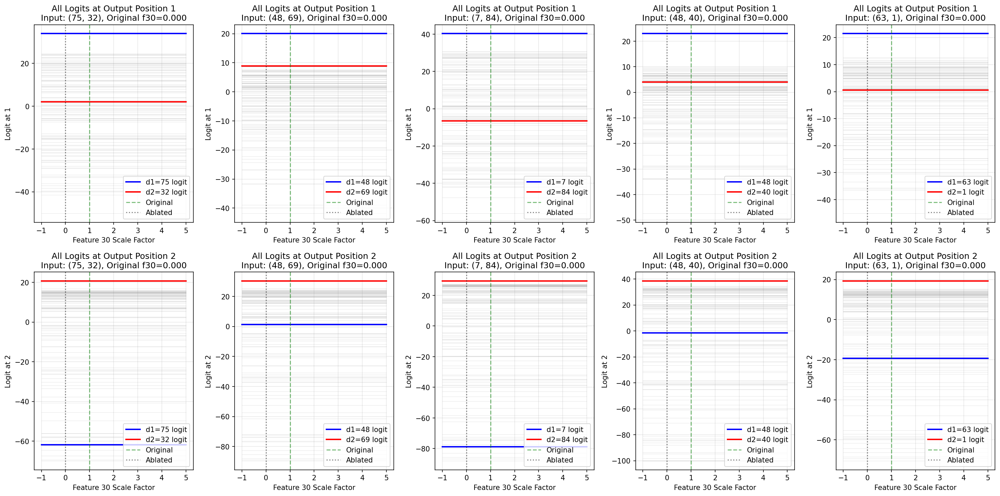
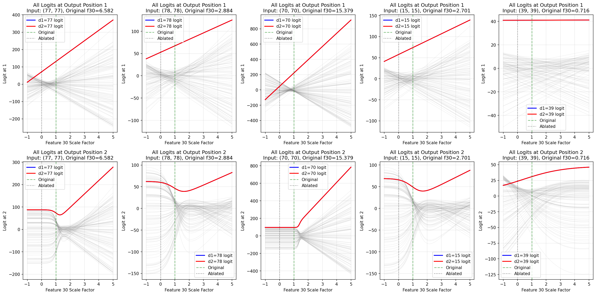
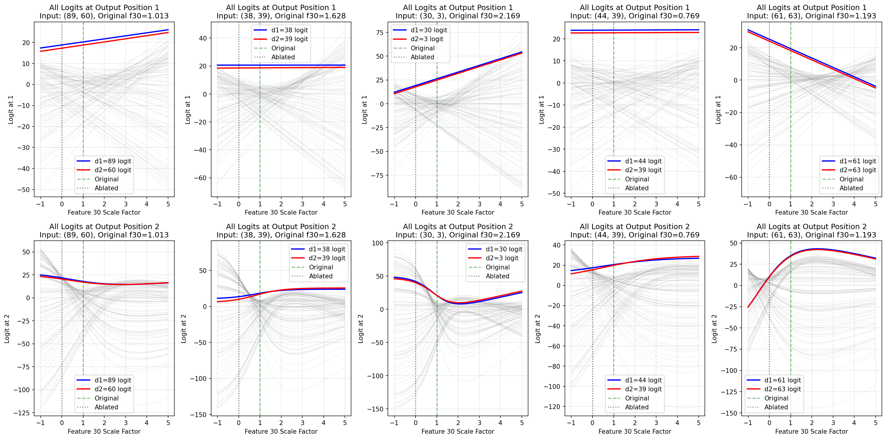
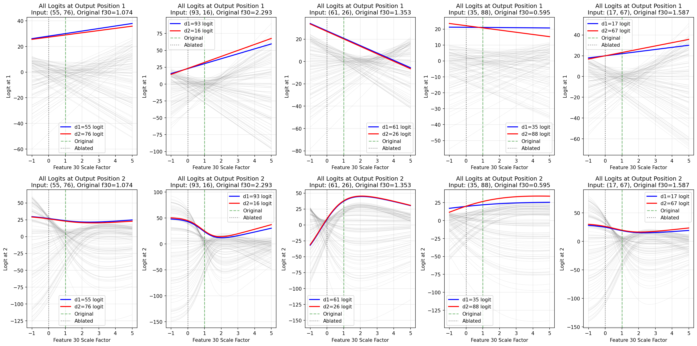
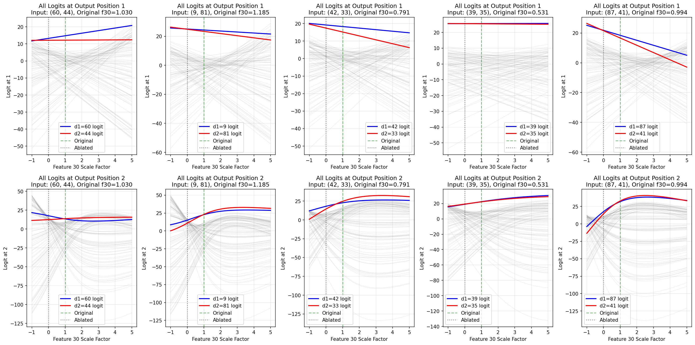
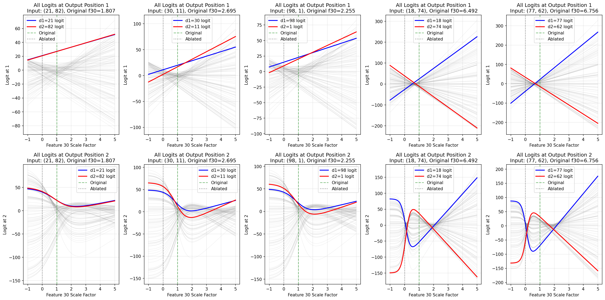
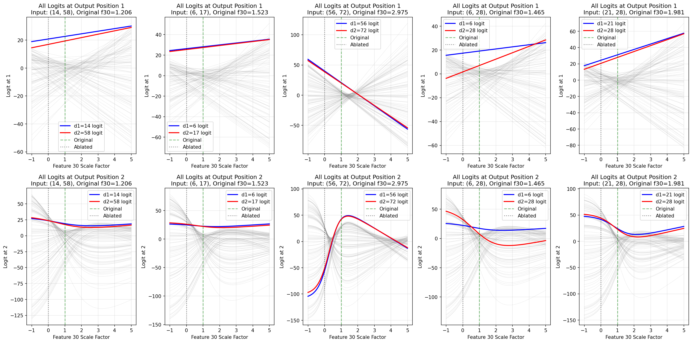
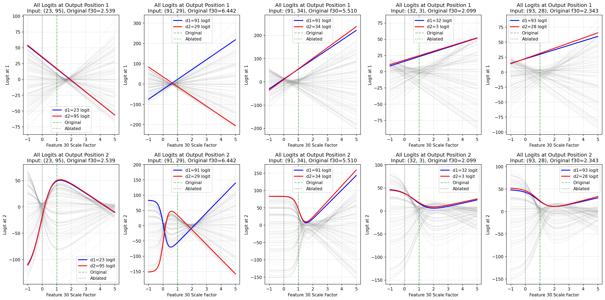

# Failure Reason Analysis — Feature 30

Pipeline: `get_xovers_df` → `get_output_swap_bounds`. Correctness is the original model accuracy (no SAE, no steering), classified per-position: **both_correct** (o1=d1 and o2=d2), **partial** (one position correct), **both_wrong**.

## Summary

| failure_reason | both_correct | partial | both_wrong | total | % of all |
|---|---|---|---|---|---|
| `success` | 5735 | 309 | 14 | 6058 | 60.6% |
| `feat_zero` | 2803 | 143 | 0 | 2946 | 29.5% |
| `d1_eq_d2` | 83 | 0 | 0 | 83 | 0.8% |
| `o1_extrapolated` | 1 | 18 | 0 | 19 | 0.2% |
| `no_o2_crossover` | 41 | 146 | 4 | 191 | 1.9% |
| `no_o2_crossover_in_bounds` | 395 | 158 | 1 | 554 | 5.5% |
| `no_overlapping_dominance` | 34 | 8 | 0 | 42 | 0.4% |
| `o1_never_predicts_d2` | 17 | 71 | 0 | 88 | 0.9% |
| `o2_never_predicts_d1` | 9 | 10 | 0 | 19 | 0.2% |
| **TOTAL** | **9118** | **863** | **19** | **10000** | 100% |

## Per-Reason Breakdown

### `success` (6058 samples)

**Correctness:** 5735 both_correct / 309 partial / 14 both_wrong

The pipeline found a valid swap zone: both o1 and o2 crossovers resolved correctly and argmax dominance confirmed a contiguous scale window where o1 predicts d2 and o2 predicts d1.

**Examples** (up to 5 of 6058):

| d1 | d2 | feat_orig | o1_crossovers | o2_crossovers | lower_bound | upper_bound | correctness |
|---|---|---|---|---|---|---|---|
| 28 | 90 | 2.368 | 0.395 | 0.399, 3.942 | 0.000 | 0.350 | both_correct |
| 93 | 99 | 5.049 | 0.626 | 0.220, 2.073 | 0.000 | 0.100 | both_correct |
| 19 | 17 | 1.157 | 1.753 | 1.647, 8.523 | 1.800 | 5.600 | both_correct |
| 49 | 19 | 1.845 | 2.159 | 0.900, 4.259 | 2.200 | 2.250 | partial |
| 17 | 29 | 4.623 | 0.652 | 0.188, 2.090 | 0.000 | 0.050 | both_correct |

**Steering experiment** (scale range -1.0–5.0, step 0.05):

**Crossover analysis:**

| d1 | d2 | feat_orig | o1_crossovers | o2_crossovers | o1_failure_reason | o1_swapped | o2_swapped |
|---|---|---|---|---|---|---|---|
| 28 | 90 | 2.3679 | 0.395 | 0.399, 3.942 | — | [False] | [True, False] |
| 93 | 99 | 5.0493 | 0.626 | 0.220, 2.073 | — | [False] | [False, False] |
| 19 | 17 | 1.1573 | 1.753 | 1.647 | — | [False] | [False] |
| 49 | 19 | 1.8447 | 2.159 | 0.900, 4.259 | — | [False] | [False, False] |
| 17 | 29 | 4.6229 | 0.652 | 0.188, 2.090 | — | [False] | [False, False] |

### `feat_zero` (2946 samples)

**Correctness:** 2803 both_correct / 143 partial / 0 both_wrong

The feature has zero activation on this input, so steering it does nothing. This is normal; the feature simply doesn't fire for every digit pair.

**Examples** (up to 5 of 2946):

| d1 | d2 | feat_orig | o1_crossovers | o2_crossovers | lower_bound | upper_bound | correctness |
|---|---|---|---|---|---|---|---|
| 75 | 32 | 0.000 | — | — | — | — | both_correct |
| 48 | 69 | 0.000 | — | — | — | — | both_correct |
| 7 | 84 | 0.000 | — | — | — | — | both_correct |
| 48 | 40 | 0.000 | — | — | — | — | both_correct |
| 63 | 1 | 0.000 | — | — | — | — | both_correct |

**Steering experiment** (scale range -1.0–5.0, step 0.05):

**Crossover analysis:**

| d1 | d2 | feat_orig | o1_crossovers | o2_crossovers | o1_failure_reason | o1_swapped | o2_swapped |
|---|---|---|---|---|---|---|---|
| 75 | 32 | 0.0000 | — | — | nonlinear_d1 | [] | [] |
| 48 | 69 | 0.0000 | — | — | nonlinear_d1 | [] | [] |
| 7 | 84 | 0.0000 | — | — | nonlinear_d1 | [] | [] |
| 48 | 40 | 0.0000 | — | — | nonlinear_d1 | [] | [] |
| 63 | 1 | 0.0000 | — | — | nonlinear_d1 | [] | [] |

### `d1_eq_d2` (83 samples)

**Correctness:** 83 both_correct / 0 partial / 0 both_wrong

Both input digits are the same (d1 == d2). The crossover framework is degenerate here because the 'swap' (d2, d1) is identical to the normal output (d1, d2).

**Examples** (up to 5 of 83):

| d1 | d2 | feat_orig | o1_crossovers | o2_crossovers | lower_bound | upper_bound | correctness |
|---|---|---|---|---|---|---|---|
| 77 | 77 | 6.582 | — | — | — | — | both_correct |
| 78 | 78 | 2.884 | — | — | — | — | both_correct |
| 70 | 70 | 15.379 | — | — | — | — | both_correct |
| 15 | 15 | 2.701 | — | — | — | — | both_correct |
| 39 | 39 | 0.716 | — | — | — | — | both_correct |

**Steering experiment** (scale range -1.0–5.0, step 0.05):

**Crossover analysis:**

| d1 | d2 | feat_orig | o1_crossovers | o2_crossovers | o1_failure_reason | o1_swapped | o2_swapped |
|---|---|---|---|---|---|---|---|
| 77 | 77 | 6.5825 | — | — | unresponsive | [] | [] |
| 78 | 78 | 2.8837 | — | — | unresponsive | [] | [] |
| 70 | 70 | 15.3791 | — | — | unresponsive | [] | [] |
| 15 | 15 | 2.7011 | — | — | unresponsive | [] | [] |
| 39 | 39 | 0.7159 | — | — | unresponsive | [] | [] |

### `o1_extrapolated` (19 samples)

**Correctness:** 1 both_correct / 18 partial / 0 both_wrong

The analytical o1 crossover is beyond scale 20 (2× the grid ceiling). The linear model is extrapolating far outside tested territory, so we flag rather than trust the value.

**Examples** (up to 5 of 19):

| d1 | d2 | feat_orig | o1_crossovers | o2_crossovers | lower_bound | upper_bound | correctness |
|---|---|---|---|---|---|---|---|
| 89 | 60 | 1.013 | — | 3.487 | — | — | partial |
| 38 | 39 | 1.628 | — | 1.577 | — | — | partial |
| 30 | 3 | 2.169 | — | 0.976 | — | — | partial |
| 44 | 39 | 0.769 | — | 1.622 | — | — | partial |
| 61 | 63 | 1.193 | — | — | — | — | partial |

**Steering experiment** (scale range -1.0–5.0, step 0.05):

**Crossover analysis:**

| d1 | d2 | feat_orig | o1_crossovers | o2_crossovers | o1_failure_reason | o1_swapped | o2_swapped |
|---|---|---|---|---|---|---|---|
| 89 | 60 | 1.0130 | — | 3.487 | o1_extrapolated | [] | [False] |
| 38 | 39 | 1.6282 | — | 1.577 | o1_extrapolated | [] | [False] |
| 30 | 3 | 2.1694 | — | 0.976 | o1_extrapolated | [] | [False] |
| 44 | 39 | 0.7692 | — | 1.622 | o1_extrapolated | [] | [False] |
| 61 | 63 | 1.1932 | — | — | o1_extrapolated | [] | [] |

### `no_o2_crossover` (191 samples)

**Correctness:** 41 both_correct / 146 partial / 4 both_wrong

No sign change in the d1−d2 logit diff at o2 across the whole scale grid. Either d1 was already beating d2 at o2 throughout, or d2 was always dominant. The pipeline has a fallback that accepts this if argmax_o2 == d1 somewhere in the o1-constrained window — this failure means even that fallback found nothing.

**Examples** (up to 5 of 191):

| d1 | d2 | feat_orig | o1_crossovers | o2_crossovers | lower_bound | upper_bound | correctness |
|---|---|---|---|---|---|---|---|
| 55 | 76 | 1.074 | -3.165 | — | — | — | partial |
| 93 | 16 | 2.293 | -0.194 | — | — | — | both_correct |
| 61 | 26 | 1.353 | -6.620 | — | — | — | both_correct |
| 35 | 88 | 0.595 | 0.777 | — | — | — | both_correct |
| 17 | 67 | 1.587 | -0.007 | — | — | — | partial |

**Steering experiment** (scale range -1.0–5.0, step 0.05):

**Crossover analysis:**

| d1 | d2 | feat_orig | o1_crossovers | o2_crossovers | o1_failure_reason | o1_swapped | o2_swapped |
|---|---|---|---|---|---|---|---|
| 55 | 76 | 1.0737 | -3.165 | — | — | [False] | [] |
| 93 | 16 | 2.2925 | -0.194 | — | — | [False] | [] |
| 61 | 26 | 1.3532 | -6.620 | — | — | [False] | [] |
| 35 | 88 | 0.5951 | 0.777 | -0.046 | — | [False] | [True] |
| 17 | 67 | 1.5870 | -0.007 | — | — | [False] | [] |

### `no_o2_crossover_in_bounds` (554 samples)

**Correctness:** 395 both_correct / 158 partial / 1 both_wrong

An o2 crossover exists, but outside the scale window constrained by the o1 crossover. The argmax fallback also found no grid point where argmax_o2 == d1 within the window.

**Examples** (up to 5 of 554):

| d1 | d2 | feat_orig | o1_crossovers | o2_crossovers | lower_bound | upper_bound | correctness |
|---|---|---|---|---|---|---|---|
| 60 | 44 | 1.030 | -0.763 | 0.917, 7.212 | — | — | partial |
| 9 | 81 | 1.185 | -0.220 | 0.910, 8.633 | — | — | both_correct |
| 42 | 33 | 0.791 | -1.325 | 0.598, 8.987 | — | — | both_correct |
| 39 | 35 | 0.531 | -0.255 | 0.540 | — | — | partial |
| 87 | 41 | 0.994 | -0.170 | 0.681, 4.696 | — | — | both_correct |

**Steering experiment** (scale range -1.0–5.0, step 0.05):

**Crossover analysis:**

| d1 | d2 | feat_orig | o1_crossovers | o2_crossovers | o1_failure_reason | o1_swapped | o2_swapped |
|---|---|---|---|---|---|---|---|
| 60 | 44 | 1.0298 | -0.763 | 0.917 | — | [False] | [False] |
| 9 | 81 | 1.1854 | -0.220 | 0.910 | — | [False] | [False] |
| 42 | 33 | 0.7913 | -1.325 | 0.598 | — | [False] | [False] |
| 39 | 35 | 0.5309 | -0.255 | 0.540 | — | [False] | [False] |
| 87 | 41 | 0.9937 | -0.170 | 0.681, 4.696 | — | [False] | [False, False] |

### `no_overlapping_dominance` (42 samples)

**Correctness:** 34 both_correct / 8 partial / 0 both_wrong

The argmax dominance ranges for o1 (predicts d2) and o2 (predicts d1) never overlap. Typically a third digit takes over the argmax in the middle of the intended swap window, breaking the required simultaneous condition.

**Examples** (up to 5 of 42):

| d1 | d2 | feat_orig | o1_crossovers | o2_crossovers | lower_bound | upper_bound | correctness |
|---|---|---|---|---|---|---|---|
| 21 | 82 | 1.807 | 1.889 | 1.003 | — | — | partial |
| 30 | 11 | 2.695 | 1.524 | 0.802, 4.841 | — | — | both_correct |
| 98 | 1 | 2.255 | 1.812 | 0.815, 5.690 | — | — | both_correct |
| 18 | 74 | 6.492 | 0.652 | 0.142, 1.907 | — | — | both_correct |
| 77 | 62 | 6.756 | 0.672 | 0.099, 1.943 | — | — | both_correct |

**Steering experiment** (scale range -1.0–5.0, step 0.05):

**Crossover analysis:**

| d1 | d2 | feat_orig | o1_crossovers | o2_crossovers | o1_failure_reason | o1_swapped | o2_swapped |
|---|---|---|---|---|---|---|---|
| 21 | 82 | 1.8072 | 1.889 | 1.003 | — | [False] | [False] |
| 30 | 11 | 2.6952 | 1.524 | 0.802, 4.841 | — | [False] | [False, False] |
| 98 | 1 | 2.2549 | 1.812 | 0.815 | — | [False] | [False] |
| 18 | 74 | 6.4919 | 0.652 | 0.142, 1.907 | — | [False] | [False, False] |
| 77 | 62 | 6.7557 | 0.672 | 0.099, 1.943 | — | [False] | [False, False] |

### `o1_never_predicts_d2` (88 samples)

**Correctness:** 17 both_correct / 71 partial / 0 both_wrong

Even though a crossover scale was found for o1, argmax_o1 never actually equals d2 on the coarse grid — a third digit steals the top logit before d2 can take over.

**Examples** (up to 5 of 88):

| d1 | d2 | feat_orig | o1_crossovers | o2_crossovers | lower_bound | upper_bound | correctness |
|---|---|---|---|---|---|---|---|
| 14 | 58 | 1.206 | 6.798 | 0.104, 8.271 | — | — | partial |
| 6 | 17 | 1.523 | 8.079 | 0.767 | — | — | partial |
| 56 | 72 | 2.975 | 1.961 | 0.821, 3.365 | — | — | partial |
| 6 | 28 | 1.465 | 4.373 | 0.531 | — | — | both_correct |
| 21 | 28 | 1.981 | 6.142 | 0.722 | — | — | both_correct |

**Steering experiment** (scale range -1.0–5.0, step 0.05):

**Crossover analysis:**

| d1 | d2 | feat_orig | o1_crossovers | o2_crossovers | o1_failure_reason | o1_swapped | o2_swapped |
|---|---|---|---|---|---|---|---|
| 14 | 58 | 1.2062 | 6.798 | 0.104 | — | [False] | [False] |
| 6 | 17 | 1.5233 | 8.079 | 0.767 | — | [False] | [False] |
| 56 | 72 | 2.9754 | 1.961 | 0.821, 3.365 | — | [False] | [False, False] |
| 6 | 28 | 1.4649 | 4.373 | 0.531 | — | [False] | [False] |
| 21 | 28 | 1.9812 | 6.142 | 0.722 | — | [False] | [False] |

### `o2_never_predicts_d1` (19 samples)

**Correctness:** 9 both_correct / 10 partial / 0 both_wrong

No grid point has argmax_o2 == d1. A third digit is always dominant at o2, preventing the required swapped output.

**Examples** (up to 5 of 19):

| d1 | d2 | feat_orig | o1_crossovers | o2_crossovers | lower_bound | upper_bound | correctness |
|---|---|---|---|---|---|---|---|
| 23 | 95 | 2.539 | 4.159 | 0.006, 7.679 | — | — | partial |
| 91 | 29 | 6.442 | 0.637 | 0.111, 1.931 | — | — | both_correct |
| 91 | 34 | 5.510 | 0.644 | 0.095, 0.684 | — | — | partial |
| 32 | 3 | 2.099 | 6.452 | 0.205 | — | — | partial |
| 93 | 28 | 2.343 | -0.364 | 1.777, 1.990 | — | — | partial |

**Steering experiment** (scale range -1.0–5.0, step 0.05):

**Crossover analysis:**

| d1 | d2 | feat_orig | o1_crossovers | o2_crossovers | o1_failure_reason | o1_swapped | o2_swapped |
|---|---|---|---|---|---|---|---|
| 23 | 95 | 2.5391 | 4.159 | 0.006 | — | [False] | [False] |
| 91 | 29 | 6.4415 | 0.637 | 0.111, 1.931 | — | [False] | [False, False] |
| 91 | 34 | 5.5097 | 0.644 | 0.095, 0.684 | — | [False] | [False, False] |
| 32 | 3 | 2.0986 | 6.452 | 0.205 | — | [False] | [False] |
| 93 | 28 | 2.3428 | -0.364 | 1.777, 1.990 | — | [False] | [False, False] |
